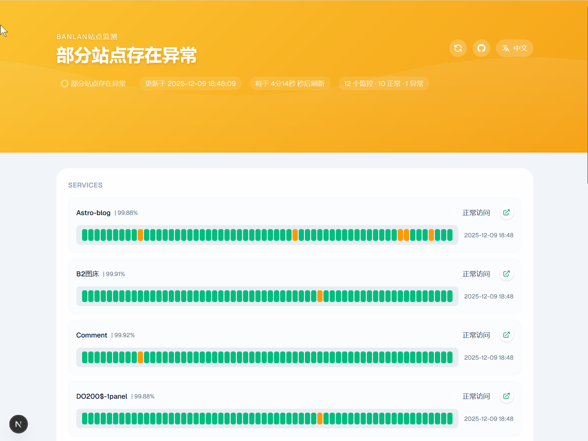
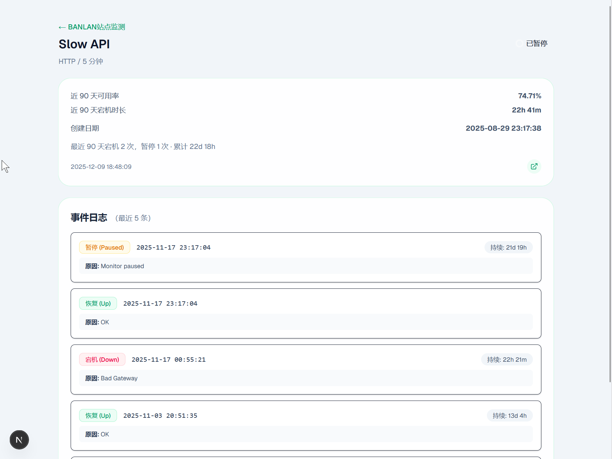

## 项目简介

基于 Next.js + Tailwind CSS 打造的自定义站点状态面板，使用 UptimeRobot Read-only API 同步监控数据，支持：

- 以卡片形式展示各监控项的状态、响应时间、可用率；
- 近期响应时间曲线（Recharts 实现）；
- 最近 90 天故障统计；
- 语言切换（中文 / English）；
- 自动刷新倒计时，可配置刷新间隔；
- 可选展示监控目标链接（通过环境变量控制）。

## 快速开始

1. 复制环境变量模板并填写：

```bash
cp env.sample .env.local
```

必填项：`UPTIMEROBOT_API_KEY`（在 UptimeRobot 仪表盘获取 Read-only API Key）。

可选项：

- `NEXT_PUBLIC_REFRESH_INTERVAL_SECONDS`：前端自动刷新间隔（秒），默认 300；
- `NEXT_PUBLIC_SHOW_MONITOR_LINKS`：是否展示跳转到监控目标的链接，默认 `true`。

2. 安装依赖：

```bash
npm install
```

3. 启动开发环境：

```bash
npm run dev
```

访问 [http://localhost:3000](http://localhost:3000) 预览。

## 生产部署（Vercel）

1. 在 Vercel 新建项目并选择本仓库；
2. 在 `Project Settings -> Environment Variables` 中配置上述环境变量；
3. 常规部署即可，默认使用 `npm run build`；
4. 如果需要禁用监控链接展示，可将 `NEXT_PUBLIC_SHOW_MONITOR_LINKS` 设置为 `false`。

## 目录结构

- `src/lib/uptimerobot.ts`：封装 API 请求与数据归一化；
- `src/components/*`：UI 组件与语言切换；
- `src/app/page.tsx`：页面入口，加载数据并渲染仪表盘。

## API 速率限制

本项目已内置 UptimeRobot API 速率限制保护（FREE plan: 10 req/min）：

- **智能缓存**：成功获取的数据会缓存 60 秒，避免重复请求；
- **速率保护**：达到限制时自动使用缓存数据，不会触发 API 错误；
- **用户友好**：即使频繁刷新页面，也不会超过速率限制；
- **透明提示**：控制台会显示详细的配额使用和缓存状态日志。

### 工作原理

```
第 1 次请求 → API 调用 (剩余 9/10) → 缓存 60 秒
第 2 次请求 (10秒后) → 使用缓存 → 不消耗配额
第 3 次请求 (20秒后) → 使用缓存 → 不消耗配额
第 4 次请求 (70秒后) → 缓存过期 → API 调用 (剩余 8/10)
...
第 11 次请求 (配额用尽) → 使用缓存或等待重置
```

### 配置

速率限制器位于 `src/lib/rate-limiter.ts`，可根据不同套餐调整：

```typescript
export const uptimeRobotLimiter = new RateLimiter({
  maxRequests: 10,      // 最大请求数（改为您的套餐限制）
  windowMs: 60 * 1000,  // 时间窗口（毫秒）
});
```

缓存时长可在 `src/lib/uptimerobot.ts` 中调整：

```typescript
const CACHE_TTL = 60 * 1000; // 缓存有效期（毫秒）
```


## Star History

[](https://www.star-history.com/#banlanzs/web-status&type=date&legend=top-left)